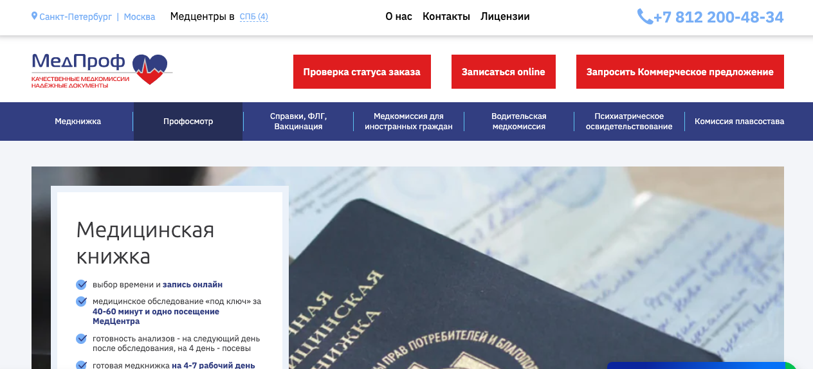

### **BOT MED PROF** 
#### **Описание:**

**Бот для записи на прием в Мед Проф центр через телеграм.**

*Возможности:*
- Запись на прием.
- Получение консультации
- Отправка документов
- Получение результатов
- напоминание о походе на консультацию

*[Посетить сайт](https://mc-medprof.ru/)*


#### **Установка**
#####1. **Скачиваем файлы:**
```
git clone https://github.com/PavelPanchenko/komarov.git
```

#####2. **Добавляем file `.env` c перемеными:**
```
BOT_TOKEN=Ваш токен бота
ADMINS=0
HOST=адрес где запущен бот, обязательно с ssl сертификатом
PORT=5000
DATABASE_NAME='data/application.db'
GROUP_ID = группа для администрирования (chat_id telegram group)


DB_USER=Имя Пользователя базы данных
DB_PASSWORD=Пароль базы данных
DB_NAME=Имя базы данных
DB_HOST=Хост базы данных
```

#####3. **Запускаем docker-file**
```
docker-compose up --build -d
```